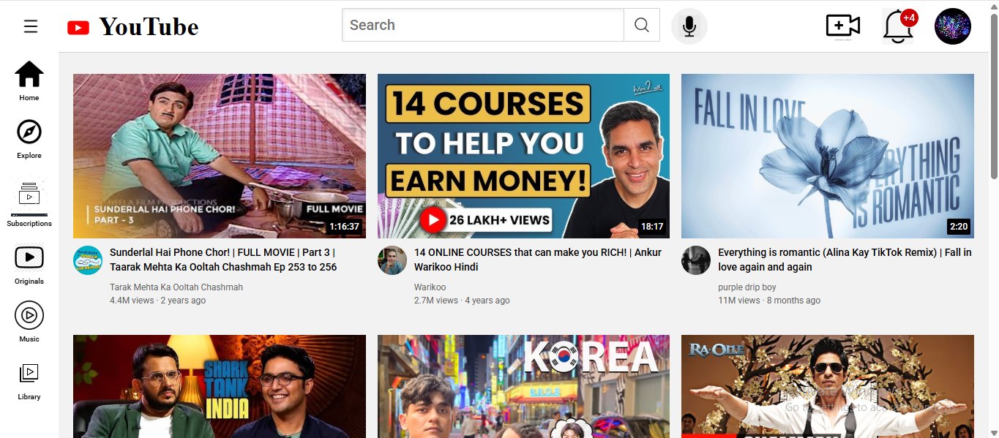
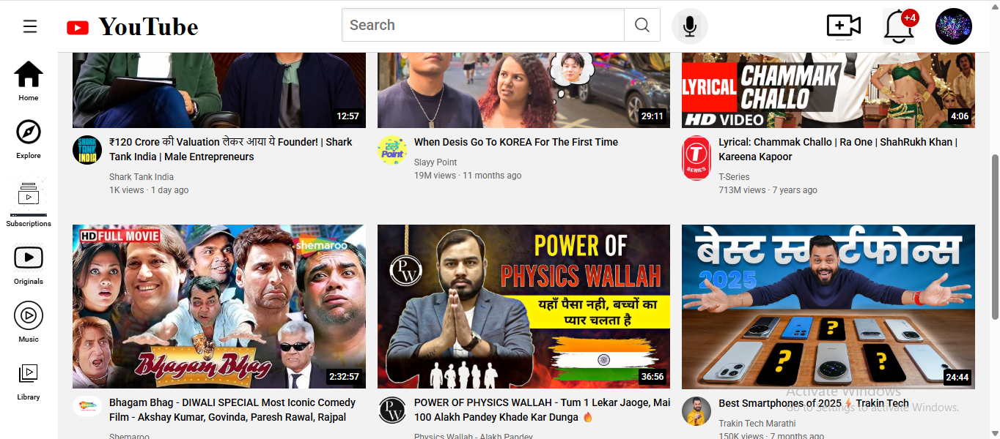
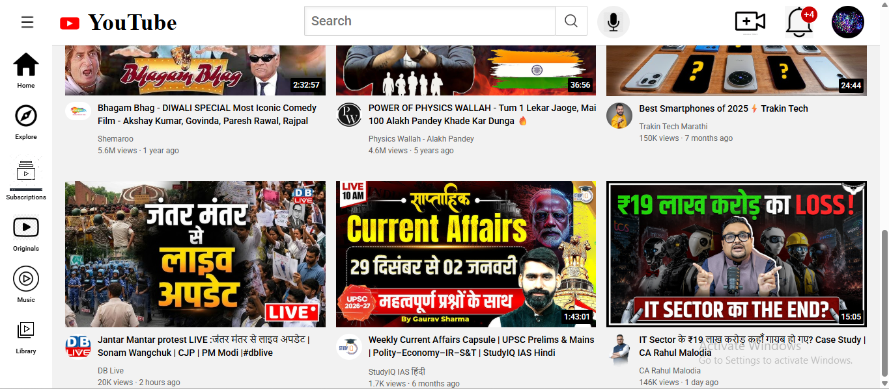

# ▶️ YouTube UI Clone

A pixel-perfect, responsive frontend clone of the YouTube homepage interface, built using modern HTML5 and CSS3 layout techniques.

## 🚀 Live Demo
[👉 Click here to explore the YouTube Clone live!](https://priya-bhagat01.github.io/my_youtube_project/)

## 📸 Preview
 
 

## 🛠️ Core Features & Layout Architecture
- **CSS Grid Video Layout:** Designed a flexible auto-responsive multi-column video grid displaying thumbnails, duration tags, creator avatars, and video metadata.
- **Fixed Top Navigation:** Engineered a sticky top bar complete with the YouTube logo, search bar with a magnifying glass button, voice search icon, and user notification controls
- Also used tooltip to search button mic button and create button.
- **Sidebar Navigation:** Built a compact left-hand sidebar with custom iconography for Home, Explore, Subscriptions, Originals, Music, and Library tabs.
- **Detail-Oriented CSS:** Handled complex UI micro-details including timestamp overlays on thumbnails, custom notification badges (`+4`), and clean typography hierarchy.

## 🧰 Tech Stack
- HTML5 (Semantic Structure)
- CSS3 (Flexbox & Grid Systems)
